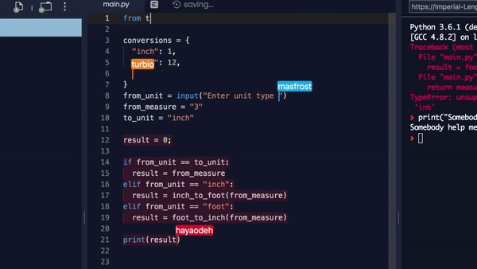

    

    

        

            

                <h1 id="typewriter" class="hero__title typewriter" data-period="2000" data-type='["программировать", "моделировать", "делать игры", "объединяться"]'>
                    Вступи в IT клуб, начни 
                </h1>
                
                    &#95;
                
            

            <!-- костыль для работы typewriter поддерживает ширину контейнера -->
            <h1 class="hero__title hidden" style="line-height: 0px !important; margin-bottom: 0px !important; user-select: none;">Вступи в IT клуб, начни программировать &#95;</h1>
            
Волонтеры и наставники помогут тебе начать

            
Открываем для молодежи из регионов бесплатные клубы

            

                <a class="md-button md-button--primary" href="https://discord.gg/EBdzkaw7xa" target="_blank">Наш Discord</a>
            

        

        

   
    

        

<h2 class="lending-h2">Точка сбора IT сообществ</h2>

где компьютерные энтузиасты общими силами развивают неформальную образовательную экосистему

<h3 class="lending-h3 color-grey">Мы занимаемся:</h3>
<ul class="color-grey lending-list">
    <li>совместным самообучением IT</li>
    <li>созданием, систематизацией образовательного контента</li>
    <li>проведением онлайн и оффлайн мероприятий</li>
    <li>просто хорошо проводим время</li>
</ul>

<h2 class="lending-h2">Наши проекты:</h2>

    

        
        <a class="md-button md-button--primary" href="/learn/godot-bootcamp/about/">Подробнее</a>
    

    

        <h3 class="capsule__title">Бесплатный геймдев буткемп</h3>

        Этим летом начни разрабатывать свои игры на движке Godot engine или помоги новичкам освоиться.
        Бесплатная программа адаптации начинающих в инди геймдеве

    

    

        <h3 class="capsule__title">Перевод Learn GDScript From Zero</h3>

        Бесплатное приложение обучающее основам программирования на языке GDScript
    

    

        
        <a class="md-button md-button--primary" href="https://tmoeg.itch.io/learn-godots-gdscript-from-zero-russian-language" target="_blank">Подробнее</a>
    

    

        
        <a class="md-button md-button--primary" href="/wiki">Подробнее</a>
    

    

        <h3 class="capsule__title">Wikicoming soon</h3>
        Бесплатный навигационный справочник по теории, практике программирования и остальным IT компетенциям

    

<h2 class="lending-h2">Получи максимальную пользу</h2>

Не стесняйся обращаться, начни учиться вместе с нами

Внутри нашего объединения несколько отдельных тематических сообществ. Вместе мы поддерживаем программы развития начинающих в разных направлениях IT, или подсказываем куда можно еще обратиться

<h3 class="lending-h3 color-grey">Популярные технологии в сообществе:</h3>

    
    
    
    
    
Roblox

<h3 class="lending-h3 color-grey">Рады помочь участникам:</h3>

<ul class="lending-list color-grey">
    <li>Составлением плана обучения, профориентацией</li>
    <li>Материалами для самообучения</li>
    <li>Наставничеством, кодревью</li>
</ul>

<h2 class="lending-h2">Для участия не важны твои умения и возраст</h2>

Как все происходит

    <ul class="row-flex-container__list color-grey">
        <li>Самоорганизуемся в дискорде</li>
        <li>Используем бесплатные сервисы, софт, материалы для обучения</li>
        <li>Совместно создаем образовательный контент</li>
        <li>TODOИногда вживую собираемся в бесплатных общественных площадках: библиотеках, культурных центрах</li>
    </ul>

    

<h2 class="lending-h2">Тут все свои. Присоединяйся!</h2>

<iframe class="widgetbot-embed" sandbox="allow-same-origin || allow-top-navigation || allow-forms || allow-scripts" title="WidgetBot Discord chat embed" src="https://e.widgetbot.io/channels/985462082814226432/985462083858624526/?api=e6b5699b-bfdb-4f11-9f95-df9e742ebab6" ></iframe>

<a class="md-button md-button--primary" href="/learn">Узнать больше о сообществе</a>

